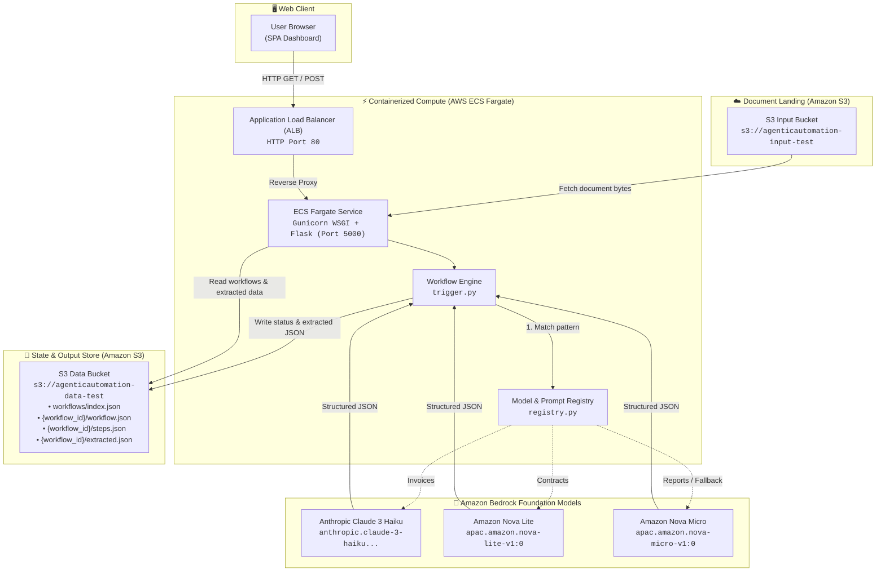
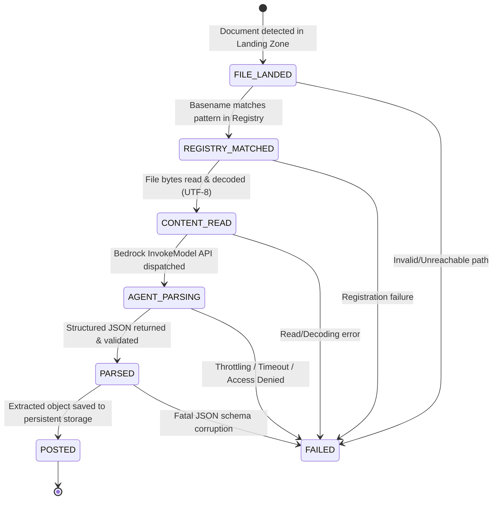

# ⚡ AgenticAutomation — Intelligent Document Processing Platform

[](https://www.python.org/)
[](LICENSE)
[](https://aws.amazon.com/)
[](https://harness.io/)

**AgenticAutomation** is an event-driven, agentic document processing and information extraction system powered by **Amazon Bedrock Foundation Models** (Claude 3 Haiku, Amazon Nova Lite, Amazon Nova Micro). 

It ingests incoming multi-format business documents (invoices, legal contracts, business intelligence reports), dynamically matches them against an in-code **Model & Prompt Registry**, extracts structured JSON entities, and streams real-time step-by-step pipeline status to a modern single-page dashboard.

---

## 📺 Live Video Demonstration

> 🎬 **Watch the System Walkthrough & UI Demo on YouTube**:  
> **[AgenticAutomation Live Dashboard Demo (https://youtu.be/KekphLDK57o)](https://youtu.be/KekphLDK57o)**

### Key Workflow States Showcased in the Demo

The demonstration highlights how the platform transparently tracks and surfaces the document lifecycle across three critical operational states:

```
┌────────────────────────────────────────────────────────────────────────────────────────┐
│                                WORKFLOW EXECUTION STATES                               │
├───────────────────────┬───────────────────────────────┬────────────────────────────────┤
│ 🟢 SUCCESS (POSTED)   │ 🔴 EXECUTION FAILED          │  🟡 UNABLE TO EXTRACT/PROCESS  │
├───────────────────────┼───────────────────────────────┼────────────────────────────────┤
│ • All 6 pipeline      │ • Model or AWS API error      │ • Unresolvable/missing file    │
│   stages succeed      │ • Bedrock throttling          │ • Malformed/empty content      │
│ • Valid JSON schema   │ • AccessDeniedException       │ • Non-JSON/corrupted response  │
│ • "Show JSON" viewer  │ • Red error badge & details   │ • Safe fallback / raw wrapped  │
└───────────────────────┴───────────────────────────────┴────────────────────────────────┘
```

1. **🟢 Success (`POSTED`)**:
   - The document flows cleanly through all six stages: `FILE_LANDED` ➔ `REGISTRY_MATCHED` ➔ `CONTENT_READ` ➔ `AGENT_PARSING` ➔ `PARSED` ➔ `POSTED`.
   - Real-time visual timeline displays green checkmarks for each completed stage with microsecond timestamps and metadata (e.g., matched regex pattern, byte count, Bedrock model ID).
   - An interactive, collapsible **Extracted Object** JSON viewer renders clean, structured key-value pairs (e.g., invoice line items, tax, contract clauses, KPI trends).

2. **🔴 Execution Failed (`FAILED`)**:
   - Represents runtime failures during processing (e.g., AWS Bedrock throttling, network timeouts, or invalid cloud credentials).
   - The pipeline visualizer halts at the failing step with a red 'X' icon, while preceding completed steps remain marked with green checkmarks for precise auditability.
   - An error callout banner exposes the exact exception and root-cause details (e.g., `ClientError: AccessDeniedException: Model access not granted`).

3. **🟡 Unable to Process / Extraction Failure**:
   - Represents business-logic or input edge cases where a document is detected but cannot yield valid structured data:
     - **Missing / Unreachable file**: File key specified does not exist in local landing directory or S3 bucket (`FileNotFoundError`).
     - **Malformed / Blank content**: Document has zero readable characters or unsupported binary encoding.
     - **Extraction Parsing Discrepancies**: If the foundation model returns freeform unstructured prose instead of JSON, the Bedrock client wraps the payload as `raw_text` fallback without crashing the pipeline, surfacing warnings for manual review.

---

## 🏛️ System Architecture

AgenticAutomation is designed with a **Dual-Mode Environment Strategy**:
- **`dev` mode**: Zero-cloud local execution with deterministic mock Bedrock responses and local filesystem persistence.
- **`test` / `prod` mode**: Fully automated serverless and containerized AWS infrastructure using **Amazon Bedrock**, **Amazon S3**, **AWS ECS Fargate**, and **Application Load Balancers (ALB)**.

### AWS Cloud Architecture




---

## 🔄 The 6-Stage Execution Pipeline

Every document passes through a sequential state machine tracked incrementally so that the dashboard surfaces real-time progress:



| Step | State Code | Description | Example Metadata Captured |
|---|---|---|---|
| **1** | `FILE_LANDED` | File identified in S3 bucket or local folder | `File detected: invoice_Q3.txt` |
| **2** | `REGISTRY_MATCHED` | Resolved optimal Bedrock model & prompt template | `Matched pattern 'invoice_*' → Claude 3 Haiku` |
| **3** | `CONTENT_READ` | Document text extracted into memory | `Read 1,420 bytes` |
| **4** | `AGENT_PARSING` | Dispatched to Amazon Bedrock with retry backoff | `Bedrock model invoked: Claude 3 Haiku` |
| **5** | `PARSED` | Model response parsed into valid JSON structure | `Extracted JSON payload valid` |
| **6** | `POSTED` | Extracted payload stored in S3/filesystem | `Saved to store (workflow complete ✓)` |
| **—** | `FAILED` | Pipeline halted due to exception | Captures full stack trace and error message |

---

## 🎯 Model & Prompt Registry

The system employs specialized prompt engineering and foundation model selection tailored to document typology:

| Pattern | Document Class | Selected Model | Target Model ID | Extracted Fields |
|---|---|---|---|---|
| `invoice_*` | Invoices & Receipts | **Anthropic Claude 3 Haiku** | `anthropic.claude-3-haiku-20240307-v1:0` | `invoice_number`, `date`, `due_date`, `vendor_name`, `vendor_address`, `bill_to`, `line_items[]`, `subtotal`, `tax`, `total`, `currency` |
| `contract_*` | Legal Agreements & NDAs | **Amazon Nova Lite** | `apac.amazon.nova-lite-v1:0` | `contract_title`, `parties[]`, `effective_date`, `expiration_date`, `contract_type`, `key_terms[]`, `total_value`, `currency`, `governing_law`, `summary` |
| `report_*` | Analytics & BI Reports | **Amazon Nova Micro** | `apac.amazon.nova-micro-v1:0` | `report_title`, `reporting_period`, `prepared_by`, `kpis[]`, `highlights[]`, `risks[]`, `recommendations[]`, `summary` |
| `*` *(fallback)* | Unclassified Documents | **Amazon Nova Micro** | `apac.amazon.nova-micro-v1:0` | Generic structured content extraction, entity tagging, and summarization |

> [!NOTE]
> For AWS Asia-Pacific regions (e.g., `ap-south-1` Mumbai), Amazon Nova models use on-demand cross-region inference profiles (`apac.amazon.nova-lite-v1:0` and `apac.amazon.nova-micro-v1:0`).

---

## 📂 Repository Directory Layout

```
AgenticAutomation/
├── .harness/                      # Harness CI/CD Pipeline definition
│   └── pipeline.yaml
├── data/                          # Local execution persistence
│   └── workflows/                 # Local JSON workflow storage
├── deploy/                        # Deployment configuration & runbooks
│   ├── AWS_MANUAL_SETUP.md        # Comprehensive AWS setup guide
│   └── ecs-task-definition.json   # AWS ECS Fargate task definition
├── sample_files/                  # Sample test documents
│   ├── contract_vendor_A.txt      # Sample legal services agreement
│   ├── invoice_Q3.txt             # Sample cloud infrastructure invoice
│   └── report_monthly.txt         # Sample monthly operations report
├── src/agenticautomation/         # Core application package
│   ├── api/
│   │   ├── __init__.py
│   │   └── server.py              # Flask REST API & static UI hosting
│   ├── processor/
│   │   ├── __init__.py
│   │   ├── bedrock_client.py      # AWS Bedrock InvokeModel + Mock engine
│   │   ├── file_reader.py         # S3 / local filesystem reader abstraction
│   │   ├── models.py              # Data models (WorkflowRun, WorkflowStep)
│   │   ├── registry.py            # Model & prompt registry configuration
│   │   └── trigger.py             # Core pipeline state machine & orchestrator
│   ├── storage/
│   │   ├── __init__.py
│   │   └── store.py               # WorkflowStore (Local & S3 implementations)
│   ├── __init__.py                # Package exports & CLI entry point
│   └── config.py                  # Dynamic environment-aware configuration
├── tests/                         # Pytest automated test suite
│   ├── test_api.py                # REST API route testing
│   ├── test_registry.py           # Pattern matching verification
│   ├── test_storage.py            # Local & S3 storage tests
│   └── test_trigger.py            # End-to-end pipeline execution tests
├── ui/                            # Modern SPA Web Dashboard
│   ├── app.js                     # Hash-routed SPA frontend logic
│   ├── index.html                 # Semantic HTML5 markup
│   └── style.css                  # Custom CSS design system (Dark/Light mode)
├── Dockerfile                     # Production container definition (Gunicorn)
├── pyproject.toml                 # Package dependencies & build configuration
└── README.md                      # Project documentation
```

---

## 🗄️ Persistence & Storage Hierarchy

Regardless of whether running on **local filesystem** or **Amazon S3**, the storage abstraction enforces a clean, partitioned schema:

```
[storage_root]/
├── index.json                        # Index of all workflow summaries (fast listing)
└── {workflow_id}/                    # Partition per workflow (e.g. wf-20260927-123456-a1b2c3)
    ├── workflow.json                 # Top-level workflow record (status, timestamps, file info)
    ├── steps.json                    # Ordered array of completed execution steps
    └── extracted.json                # Parsed structured JSON payload from the model
```

### JSON Schema Examples

<details>
<summary><strong>View <code>workflow.json</code></strong></summary>

```json
{
  "workflow_id": "wf-20260927-142210-9f8a3c",
  "file_name": "invoice_Q3.txt",
  "file_key": "sample_files/invoice_Q3.txt",
  "model_id": "anthropic.claude-3-haiku-20240307-v1:0",
  "status": "POSTED",
  "created_at": "2026-09-27T14:22:10Z",
  "updated_at": "2026-09-27T14:22:14Z",
  "error_message": null
}
```
</details>

<details>
<summary><strong>View <code>steps.json</code></strong></summary>

```json
[
  {
    "step_name": "FILE_LANDED",
    "status": "SUCCESS",
    "detail": "File detected: invoice_Q3.txt",
    "timestamp": "2026-09-27T14:22:10Z"
  },
  {
    "step_name": "REGISTRY_MATCHED",
    "status": "SUCCESS",
    "detail": "Matched pattern 'invoice_*' → Claude 3 Haiku (anthropic.claude-3-haiku-20240307-v1:0)",
    "timestamp": "2026-09-27T14:22:11Z"
  },
  {
    "step_name": "CONTENT_READ",
    "status": "SUCCESS",
    "detail": "Read 1,283 bytes",
    "timestamp": "2026-09-27T14:22:11Z"
  },
  {
    "step_name": "AGENT_PARSING",
    "status": "SUCCESS",
    "detail": "Bedrock model invoked: Claude 3 Haiku",
    "timestamp": "2026-09-27T14:22:13Z"
  },
  {
    "step_name": "PARSED",
    "status": "SUCCESS",
    "detail": "Extracted JSON payload valid",
    "timestamp": "2026-09-27T14:22:13Z"
  },
  {
    "step_name": "POSTED",
    "status": "SUCCESS",
    "detail": "Saved to store",
    "timestamp": "2026-09-27T14:22:14Z"
  }
]
```
</details>

<details>
<summary><strong>View <code>extracted.json</code></strong></summary>

```json
{
  "workflow_id": "wf-20260927-142210-9f8a3c",
  "model_id": "anthropic.claude-3-haiku-20240307-v1:0",
  "data": {
    "invoice_number": "INV-2026-Q3-0847",
    "date": "2026-07-15",
    "due_date": "2026-08-14",
    "vendor_name": "Stellar Supplies Co.",
    "subtotal": 8750.00,
    "tax": 721.88,
    "total": 9471.88,
    "currency": "USD",
    "line_items": [
      {
        "description": "Cloud Compute (GPU Instances) — July 2026",
        "quantity": 120,
        "unit_price": 45.00,
        "amount": 5400.00
      }
    ]
  },
  "created_at": "2026-09-27T14:22:14Z"
}
```
</details>

---

## 🚀 Quickstart: Running Locally

You can run the entire solution on your workstation with **zero AWS dependencies or cloud costs** using the built-in Mock Bedrock engine.

### Prerequisites
- Python 3.12 or 3.13+ installed
- [uv](https://docs.astral.sh/uv/) (recommended) or standard `pip`

### Step 1: Clone and Set Up Virtual Environment

Using `uv`:
```bash
git clone https://github.com/your-username/AgenticAutomation.git
cd AgenticAutomation

# Create virtual environment and sync dependencies
uv venv
# Windows:
.venv\Scripts\activate
# Linux/macOS:
source .venv/bin/activate

uv pip install -e ".[dev]"
```

Using standard `pip`:
```bash
python -m venv .venv
# Windows:
.venv\Scripts\activate
# Linux/macOS:
source .venv/bin/activate

pip install -e ".[dev]"
```

### Step 2: Start the Web Dashboard & API

```bash
# Start the server (defaults to http://localhost:5000 in dev mode)
python -m agenticautomation.api.server
```

Open your browser to **`http://localhost:5000`**. You will be greeted by the dashboard.

### Step 3: Trigger Document Processing

You can trigger processing in three ways:

1. **Via Web UI**: Click the **Trigger** button in the top navigation bar, choose a sample document (`invoice_Q3.txt`, `contract_vendor_A.txt`, or `report_monthly.txt`), and click **Process Document**.
2. **Via CLI**:
   ```bash
   python -m agenticautomation process sample_files/invoice_Q3.txt
   ```
3. **Via REST API (`curl`)**:
   ```bash
   curl -X POST http://localhost:5000/api/trigger \
        -H "Content-Type: application/json" \
        -d '{"filename": "contract_vendor_A.txt"}'
   ```

### Step 4: Run the Test Suite

```bash
pytest -v
```

---

## 🌐 Deploying to AWS Cloud

For a full manual setup walkthrough, consult [`deploy/AWS_MANUAL_SETUP.md`](file:///e:/IntelliJ/intelliWorkspace/AgenticAutomation/deploy/AWS_MANUAL_SETUP.md).

### 1. Provision Infrastructure
- **Amazon S3 Buckets**:
  - `agenticautomation-input-test` (Landing zone)
  - `agenticautomation-data-test` (Output & state storage)
- **Amazon ECR**:
  - Repository `agenticautomation` in `ap-south-1`
- **IAM Policies**:
  - `agenticautomation-ecs-execution-role` (AmazonECSTaskExecutionRolePolicy)
  - `agenticautomation-ecs-task-role` (`s3:*` on buckets, `bedrock:InvokeModel` on `*`)
- **Networking & ALB**:
  - Application Load Balancer internet-facing on port 80.
  - Target Group routing to port 5000 with `/health` check.
- **ECS Fargate Cluster**:
  - Service running tasks defined in [`deploy/ecs-task-definition.json`](file:///e:/IntelliJ/intelliWorkspace/AgenticAutomation/deploy/ecs-task-definition.json).

### 2. Build and Push Container Image

```bash
# Authenticate to ECR
aws ecr get-login-password --region ap-south-1 | docker login --username AWS --password-stdin <ACCOUNT_ID>.dkr.ecr.ap-south-1.amazonaws.com

# Build Linux AMD64 container
docker build -t agenticautomation:latest .

# Tag and push
docker tag agenticautomation:latest <ACCOUNT_ID>.dkr.ecr.ap-south-1.amazonaws.com/agenticautomation:latest
docker push <ACCOUNT_ID>.dkr.ecr.ap-south-1.amazonaws.com/agenticautomation:latest
```

### 3. Environment Variables Configuration

| Variable | Dev Default | Cloud Value | Purpose |
|---|---|---|---|
| `ENV` | `dev` | `prod` / `test` | Switches between local and cloud configurations |
| `STORAGE_BACKEND` | `local` | `s3` | Switches store between local disk and S3 |
| `AWS_REGION` | `ap-south-1` | `ap-south-1` | Target AWS region for Bedrock & S3 |
| `S3_INPUT_BUCKET` | *(none)* | `agenticautomation-input-test` | Bucket where landing documents are read |
| `S3_DATA_BUCKET` | *(none)* | `agenticautomation-data-test` | Bucket where workflows/JSON are written |
| `MOCK_BEDROCK` | `true` | `false` | `false` engages live AWS Bedrock foundation models |
| `PORT` | `5000` | `5000` | Port exposed by Gunicorn inside container |

---

## 🛠️ REST API Reference

The Flask application exposes standard REST endpoints consumed by both the dashboard and external automated webhooks:

| Method | Endpoint | Description |
|---|---|---|
| `GET` | `/health` | Healthcheck endpoint utilized by ALB and ECS container orchestrator |
| `GET` | `/api/workflows` | List all historical workflow runs sorted chronologically (descending) |
| `GET` | `/api/workflows/<id>` | Fetch detailed workflow metadata and ordered step execution status |
| `GET` | `/api/workflows/<id>/object` | Retrieve the parsed structured JSON extraction object for a workflow |
| `POST` | `/api/trigger` | Manually dispatch a document for execution (`{"filename": "..."}`) |
| `GET` | `/` | Serves the single-page application dashboard |

---

## 🛡️ Security & Best Practices

- **Zero Hardcoded Secrets**: AWS credentials, bucket names, and regions are dynamically injected via IAM Roles and environment variables.
- **Least-Privilege IAM**: ECS task roles are strictly scoped to the input/output S3 ARNs and `bedrock:InvokeModel`.
- **Throttling & Backoff**: The Bedrock client implements exponential backoff retry algorithms to gracefully handle model quota limits.
- **Fail-Safe Sanitization**: LLM output markdown fences (e.g. ` ```json `) are automatically sanitized and stripped before JSON parsing.

---

## 📄 License

This project is licensed under the MIT License — see the LICENSE file for details.
